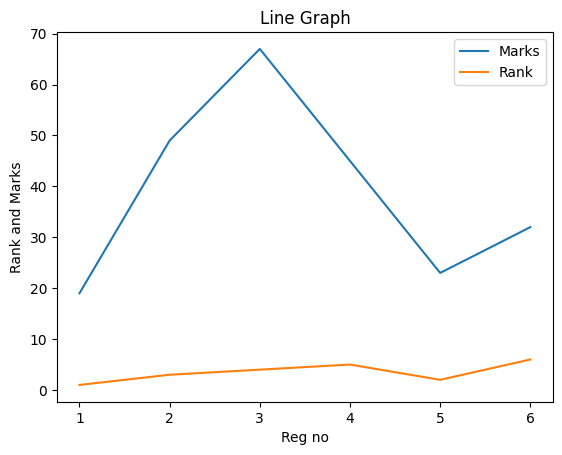
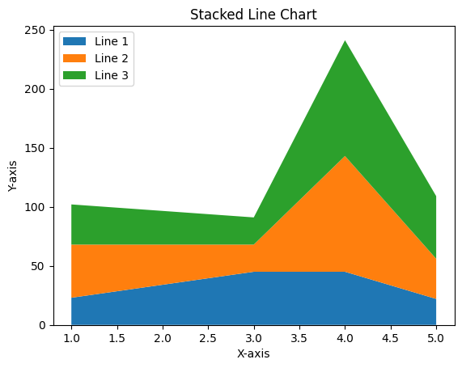

# EXNO-5-DS-DATA VISUALIZATION USING MATPLOT LIBRARY

# Aim:
  To Perform Data Visualization using matplot python library for the given datas.

# EXPLANATION:
Data visualization is the graphical representation of information and data. By using visual elements like charts, graphs, and maps, data visualization tools provide an accessible way to see and understand trends, outliers, and patterns in data.

# Algorithm:
STEP 1:Include the necessary Library.

STEP 2:Read the given Data.

STEP 3:Apply data visualization techniques to identify the patterns of the data.

STEP 4:Apply the various data visualization tools wherever necessary.

STEP 5:Include Necessary parameters in each functions.
# Coding and Output:
### NAME : KAVINRAJA D
### REG NO : 212222240047
### Line
 ```python
import matplotlib.pyplot as plt
x=[1,2,3,4,5,6]
y=[19,49,67,45,23,32]
plt.plot(x,y,color='green',linestyle='dashed',linewidth=2,marker='o',markerfacecolor='blue',markersize=12)
plt.title('Line graph')
plt.xlabel("Reg no")
plt.ylabel('Marks')
plt.show()
z=[1,3,4,5,2,6]
plt.plot(x,y,label='Marks')
plt.plot(x,z,label='Rank')
plt.ylabel("Rank and Marks")
plt.xlabel("Reg no")
plt.title("Line Graph")
plt.legend()
plt.show()
```


### Bar graph
```python
height =[10, 24, 36, 18, 5]
names = ['one', 'two', 'three', 'four', 'five']
c1=['red', 'green']
c2=['b', 'g'] # we can use this for color
plt.bar (names, height, width=0.8, color=c1)
plt.xlabel('x - axis')
plt.ylabel('y axis')
plt.title('My bar chart!')
plt.show()

x = [2,8,10]
y = [11,16,9]
x2= [3,9,11]
y2 = [6,15,7]
plt.bar(x, y,color='r')
plt.bar(x2, y2, color = 'g')
plt.title("bar graph")
plt.ylabel('Y axis')
plt.xlabel('X axis')
plt.show()
```


### Scatterplot
```python
import numpy as np
x=np.arange(0,10)
y=np.arange(11,21)
plt.title("Scatter plot")
plt.plot(x,y,'g*')
plt.xlabel("X-AXIS")
plt.ylabel("Y-LABEL")
plt.show()
x=np.arange(0,15)
y=np.arange(0,15)
x
y
plt.scatter(x,y,c='r')
plt.xlabel('X axis')
plt.ylabel('y axis')
plt.title('Scatter plot')
plt.show()
```


### Histogram
```python
ages =[2,5,70,40,30,45,50,45,43,40,44,60,7,13,57,18,90,77,32,21,20,40]
bins =10
range =(0, 100)
plt.hist(ages, bins, range, color='green',histtype='bar',rwidth=1)
plt.xlabel('age')
plt.ylabel('No. of people')
plt.title('My histogram')
plt.show()
x=[2,5,70,40,30,45,50,45,43,40,44,60,7,13,57,18,90,77,32,21,20,40]
plt.title('My histogram')
plt.hist(x,bins=10,alpha=0.8)
plt.show()
```


### Area Chart
```py
x=[1,3,4,5]
y1=[23,45,45,22]
y2=[45,23,98,34]
y3=[34,23,98,53]
plt.title("Area Plot")
plt.fill_between(x,y1,color='green')
plt.fill_between(x,y2,color='yellow')
plt.plot(x,y1,color='red')
plt.plot(x,y2,color='black')
plt.legend(['y1','y2'])
plt.show()
plt.stackplot(x, y1, y2, y3, labels=['Line 1', 'Line 2', 'Line 3'])
plt.legend(loc='upper left')
plt.title('Stacked Line Chart')
plt.xlabel('X-axis')
plt.ylabel("Y-axis")
plt.show()
```


### Pie chart
```python
act=['eat','sleep','work','play']
slices=[3,7,8,6]
color=['r','y','g','b']
plt.pie(slices,labels=act,colors=color,startangle=90,shadow=True,explode=(0.1,0.1,0.1,0.1),radius=1.2,autopct='%1.1f%%')
plt.legend()
plt.show()

feedback=['Good','excellent','Perfect','Ok']
slices=[4,10,3,8]
color=['y','r','b','g']
plt.pie(slices,labels=feedback,colors=color,startangle=90,shadow=True,explode=(0.1,0.1,0.1,0.1),radius=1.2,autopct='%1.1f%%')
plt.legend()
plt.show()
```


### Box PLot
```py
import matplotlib.pyplot as plt
import numpy as np
np.random.seed(10)
data1 = np.random.normal(100, 20, 200)
data2 = np.random.normal(80, 30, 200)
data3 = np.random.normal(90, 25, 200)
data = [data1, data2, data3]
plt.figure(figsize=(8, 6))
plt.boxplot(data)
plt.xticks([1, 2, 3], ['Data 1', 'Data 2', 'Data 3'])
plt.ylabel('Values')
plt.title('Boxplot Example')
plt.grid(True)
plt.show()
```


# Result:
Thus, all the data visualization techniques of matplotlib has been implemented.